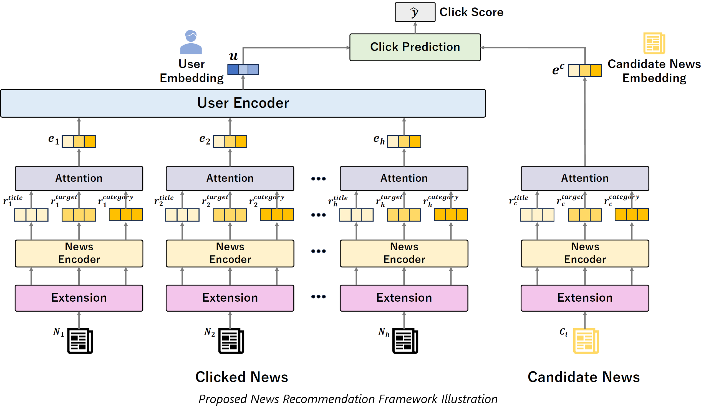

# NRGETC
Code for our paper 
# "A News Recommendation Framework Utilizing ChatGPT: Estimating Target Audience and News Categories"


# Description of folder structure.
```
📦 your-repo-name
├── 📁 src                # アプリケーションのメインソースコード
│   ├── 📄 main.py        # メインの実行ファイル
│   └── 📁 utils          # ユーティリティ関数やヘルパースクリプト
│       └── 📄 helper.py  # 補助関数を定義したスクリプト
├── 📁 (data)               # This folder must be created according to the Data Download instructions below.
├── 📁 Generated_data     # Stores information generated by GPT (targets and categories)
    ├── 📄 Generated_Target.csv   
│   └── 📄 Generated_Category.csv
├── 📁 GPT_Augmentation     # Information extension using ChatGPT's API.
    ├── 📄 GPT_API.ipynb
│   └── 📄 all_news_title.csv
├── 📄 README.md          # リポジトリの説明書
└── 📄 requirements.txt   # 必要なPythonパッケージのリスト
```

# Data Download
Download and preprocess the data.
```bash
mkdir data && cd data
# Download GloVe pre-trained word embedding
wget https://nlp.stanford.edu/data/glove.840B.300d.zip
sudo apt install unzip
unzip glove.840B.300d.zip -d glove
rm glove.840B.300d.zip

# Download MIND dataset
# By downloading the dataset, you agree to the [Microsoft Research License Terms](https://go.microsoft.com/fwlink/?LinkID=206977). For more detail about the dataset, see https://msnews.github.io/.
# Uncomment the following lines to use the MIND Small dataset (Note MIND Small doesn't have a test set, In our paper we use the validation data from the original dataset as test data in this experiment.
In addition, the training data in the original dataset are divided into the training data (first 5 days) and the validation data (last 1 day) for this experiment. So you need to do the splitting of the data set after downloading:)
wget https://mind201910small.blob.core.windows.net/release/MINDsmall_train.zip https://mind201910small.blob.core.windows.net/release/MINDsmall_dev.zip
unzip MINDsmall_train.zip -d train
unzip MINDsmall_dev.zip -d val
rm MINDsmall_*.zip
